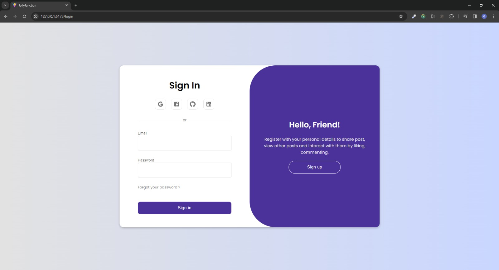
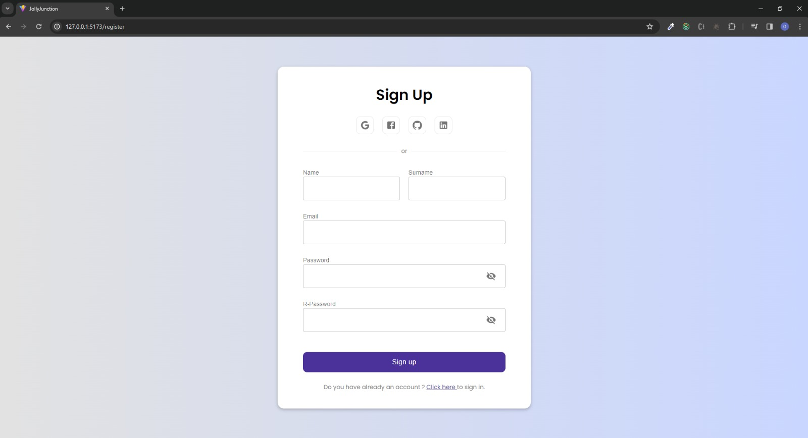
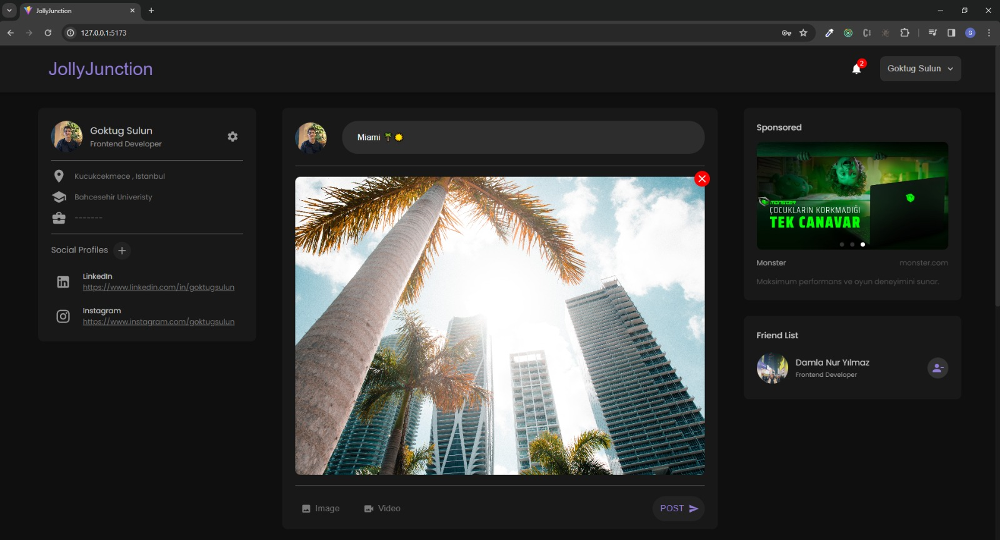
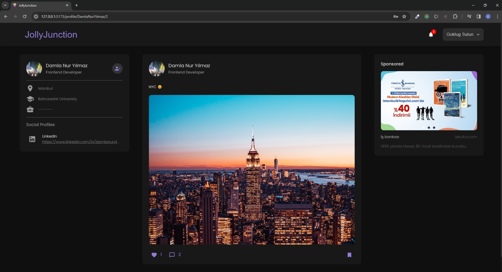
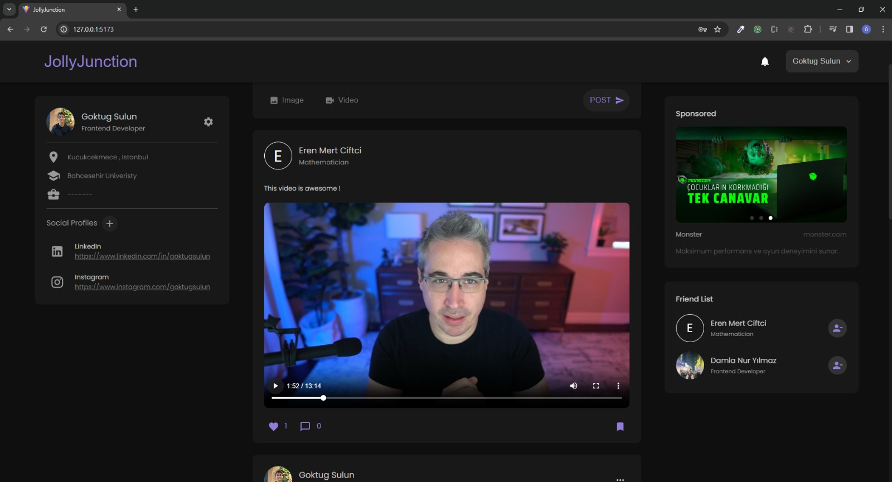
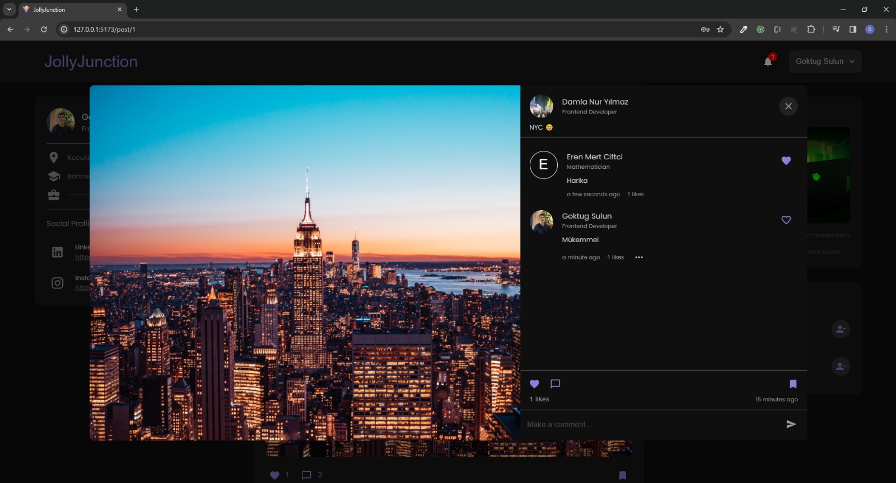
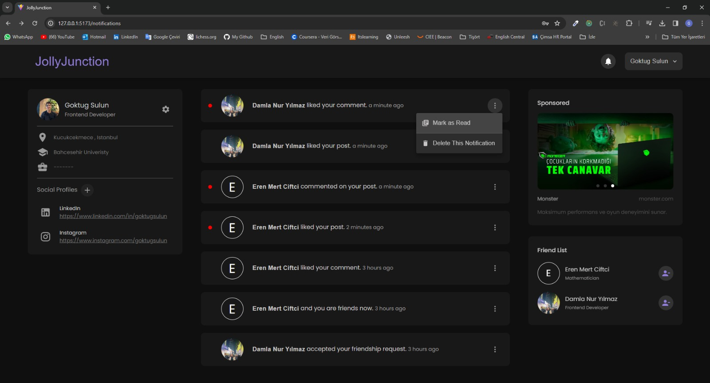

<h1> JollyJunction - Social Media Project </h1>

<h2> 🌐 Overview </h2>

&nbsp;&nbsp;&nbsp; JollyJunction is a social media project created to enhance my portfolio and personal development. The project has evolved over time, incorporating various features and improvements to meet its evolving requirements.

<h2> 💻 Technologies Used </h2>

* <strong> Frontend: </strong> React.js
* <strong> Backend: </strong> Express.js
* <strong> Database: </strong> JSON-server (initially), lowdb (finally)
* <strong> Helper packages: </strong> Redux-toolkit, Redux-saga, React-router, Material UI, Emotion, React-hook-form, Axios, Notistack, Jsonwebtoken, Multer, ...

<h2> 📷 Screenshots </h2>
<strong> LOGIN PAGE </strong>
 
 

<strong> REGISTER PAGE </strong>
 
 

<strong> CREATE A POST </strong>
 
 

<strong> POST THAT INCLUDES AN IMAGE </strong>
 
 

<strong> POST THAT INCLUDES A VIDEO </strong>
 
 

<strong> POST DETAIL </strong>
 
 

<strong> NOTIFICATIONS </strong>
 
 

<strong> USER PROFILE </strong>
 
 

<h2> 🚀 Features </h2>

* <strong> Post Sharing: </strong> Users can share posts with the community.
* <strong> Post Interaction: </strong> Like, save, and comment on posts to engage with others.
* <strong> Friendship: </strong> Add and connect with friends within the platform.
* <strong> Profile customization: </strong> Customize your profile to introduce yourself.
 
<h2> 🔄 Project Evolution </h2>

&nbsp;&nbsp;&nbsp; Started with a simple JSON-server, the project progressed to integrate Express.js for a more robust backend, providing a foundation for future enhancements.

<h2> 🔍 Future Improvements </h2>

&nbsp;&nbsp;&nbsp; While the project has achieved several milestones, there are areas for improvement: 

* Create posts with multiple images and videos.
* View posts that have been liked and saved.
* Share a story or short and view your friends' story or short.
* Send a message to your friends.
* Comment for another comment.

<h2> 🏁 Getting Started </h2>

&nbsp;&nbsp;&nbsp; To run the project locally, follow these steps: 

* Clone the repository.
* Install dependencies using <code>npm install</code> for global folder, frontend folder, and backend folder.
* Create a <code>.env</code> file in the frontend folder and write <code>VITE_API_URL = "http://localhost:3000"</code> in it.
* Create a <code>.env</code> file in the backend folder and write <code>VITE_TOKEN_SECRET = "your_secure_random_string"</code> (Generate a secure random string to enhance security.)
* Run the project with <code>npm start</code>.
